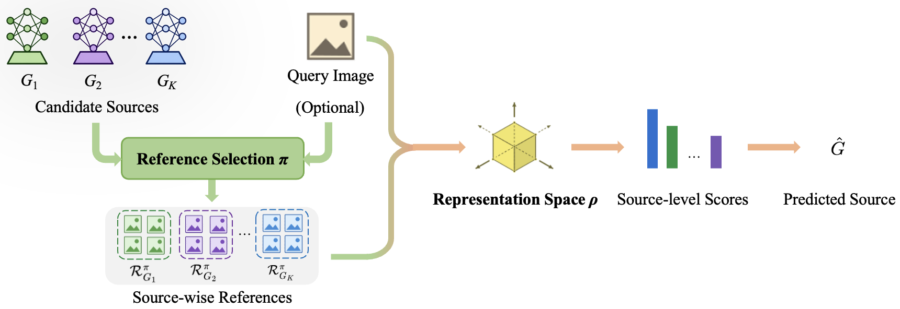

<h1 align="center">RefPrint</h1>

<h3 align="center">
Representation and Reference Selection in Training-Free Synthetic Image Attribution
</h3>

<p align="center">
  <a href="https://scholar.google.com/citations?user=rOOhvV0AAAAJ"><strong>Meiling Li</strong></a><sup>1</sup>
  &nbsp;&nbsp;
  <a href="https://scholar.google.com/citations?user=n-bJAaQAAAAJ&hl=en&oi=ao"><strong>Pietro Bongini</strong></a><sup>2</sup>
  &nbsp;&nbsp;
  <a href="https://scholar.google.com/citations?user=xpNEfq4AAAAJ&hl=en&oi=ao"><strong>Benedetta Tondi</strong></a><sup>2</sup>
  &nbsp;&nbsp;
  <a href="https://scholar.google.com/citations?user=ntRScY8AAAAJ"><strong>Mauro Barni</strong></a><sup>2</sup>
</p>

<p align="center">
  <sup>1</sup> College of Computer Science and Artificial Intelligence, Fudan University
  <br>
  <sup>2</sup> Department of Information Engineering and Mathematics, University of Siena
</p>

<p align="center">
  <a href="https://arxiv.org/abs/2607.12052">📄 Paper</a>
  &nbsp;·&nbsp;
  <a href="https://huggingface.co/datasets/Meilinger00/BC-Attr-6">🤗 BC-Attr-6</a>
  &nbsp;·&nbsp;
  <a href="#datasets">📦 Datasets</a>
  &nbsp;·&nbsp;
  <a href="#citation">📚 BibTeX</a>
</p>

<p align="center">
  
</p>

## Overview

**RefPrint** provides a controlled analysis of **training-free reference-based synthetic image attribution (SIA)** from a joint representation–reference perspective.

Rather than training or fine-tuning a task-specific classifier or fingerprint extractor, a query image is attributed by comparing it with source-specific references from candidate generators. We study two coupled factors:

- **Representation selection:** where should query and reference images be compared?
- **Reference selection:** how should source-specific references be constructed?

Our experiments show that attribution accuracy consistently peaks at **intermediate representation layers**, where source-discriminative cues remain accessible before strong semantic abstraction dominates. At the same time, these representations are not semantically neutral, making reference selection critical for reducing query–reference semantic mismatch.

## Key Findings

- **Intermediate representations outperform final semantic embeddings** across CLIP and DINOv2.
- **Semantically constrained references improve attribution**, especially when the reference budget is limited.
- **Resynthesis is most useful with very few references**, while semantically aligned retrieval provides a better accuracy–cost trade-off when a moderate reference pool is available.
- The main trends remain stable across different score aggregation rules and common post-processing operations.

## News

- **2026-09:** BC-Attr-6 is publicly available on Hugging Face.
- **2026-07:** RefPrint is available on arXiv.

## Datasets

We evaluate RefPrint on three datasets: the existing face-only **FaceResyn** benchmark and two attribution datasets constructed in this work, **BC-Attr-6** and **COCO-Attr**.

| Dataset | Status | Description | Download |
|---|---|---|---|
| **BC-Attr-6** | ✅ Available | Bias-controlled benchmark with 10 generators and 6 semantic categories | [Hugging Face](https://huggingface.co/datasets/Meilinger00/BC-Attr-6) |
| **COCO-Attr** | 🚧 Coming soon | Attribution benchmark generated from MSCOCO-derived captions | — |

### BC-Attr-6

**BC-Attr-6 (Bias-Controlled Attribution-6)** is designed to reduce source–semantic bias through balanced semantic categories and prompts shared across generators.

It contains:

- **10 text-to-image generators**
- **6 semantic categories**
- **12,000 pre-generated images**
  - **1,200 query images**
  - **10,800 pre-generated reference images**
- **120,000 query-conditioned resynthesis reference images**

For each generator–category pair, 200 images are generated, with 20 used as queries and 180 retained in the pre-generated reference pool.

The release provides the exact reference-selection protocols used in our experiments:

- **Arbitrary references:** sampled from the source-specific reference pool without semantic matching;
- **Semantically aligned references:** selected from the same semantic category as the query;
- **Resynthesis references:** generated from candidate sources using a textual description of the query.

See the [BC-Attr-6 dataset card](https://huggingface.co/datasets/Meilinger00/BC-Attr-6) for the complete data structure, metadata, protocols, and usage instructions.

### COCO-Attr

**COCO-Attr** uses the same candidate generators as BC-Attr-6 but replaces predefined semantic categories with **MSCOCO-derived captions** as generation prompts, providing a more heterogeneous distribution of objects, scenes, and compositions.

The dataset contains **1,000 query images** in total.

> **Release in progress.**

## Method

Let a query image be compared with a reference set associated with each candidate generator.

RefPrint follows four steps:

1. extract query and reference representations using a **frozen pretrained visual encoder**;
2. represent each image using the **CLS token from a selected transformer layer**;
3. compute **cosine similarity** between the query and individual references;
4. use **max similarity** over each source-specific reference set as the source score and predict the source with the highest score.

We study two frozen ViT-L/14 encoders:

- **CLIP ViT-L/14@336**
- **DINOv2 ViT-L/14**

Both contain 24 transformer layers, allowing us to analyze how source attribution changes from shallow to intermediate and final representations.

### Reference Selection

We consider three reference-selection strategies with progressively weaker query–reference semantic constraints:

| Strategy | Source of References | Query-dependent | Semantic Constraint |
|---|---|---:|---|
| **Resynthesis** | Candidate generator | Yes | Strong |
| **Semantically aligned** | Pre-generated source pool | Yes | Moderate |
| **Arbitrary** | Pre-generated source pool | No | Weak |

For **resynthesis**, a textual description of the query is used to generate new references from each candidate source.

For **semantically aligned retrieval**, references are selected from a pre-generated source-specific pool according to semantic correspondence with the query.

For **arbitrary sampling**, references are sampled from the source-specific pool without enforcing semantic correspondence.

### Reference Budget

The main experiments use **10 references per candidate source** unless otherwise specified.

On BC-Attr-6, we further study:

`M ∈ {1, 2, 4, 10, 25, 50, 100}`

for pre-generated references. Resynthesis is evaluated up to `M = 10` due to generation cost.

No task-specific attribution classifier or fingerprint extractor is trained.

## Code

> **Code release is in progress.**

The implementation and reproduction scripts will be released in this repository.

## Citation

If you find this work or the released datasets useful, please cite:

```bibtex
@misc{li2026representationreferenceselectiontrainingfree,
  title={Representation and Reference Selection in Training-Free Synthetic Image Attribution},
  author={Meiling Li and Pietro Bongini and Benedetta Tondi and Mauro Barni},
  year={2026},
  eprint={2607.12052},
  archivePrefix={arXiv},
  primaryClass={cs.CV},
  url={https://arxiv.org/abs/2607.12052}
}
```

## Contact

For questions about the paper, datasets, or code, please open a GitHub issue.
